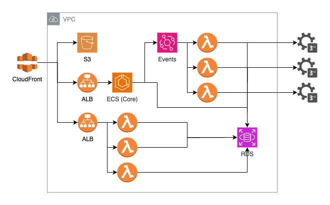

# Instructions

The following diagram shows the infrastructure of a SaaS application. It does the following:

1. Serves up static assets including js and css
2. Authenticates users
3. Read/writes to a database
4. Triggers events
5. Contacts 3rd party services

Take a look at the diagram.

1. Ask any questions you may have about the resources shown.
2. The interviewer will provide any clarity and additional information.
3. Describe the types of automated testing that you would perform and how you would prioritize them.

